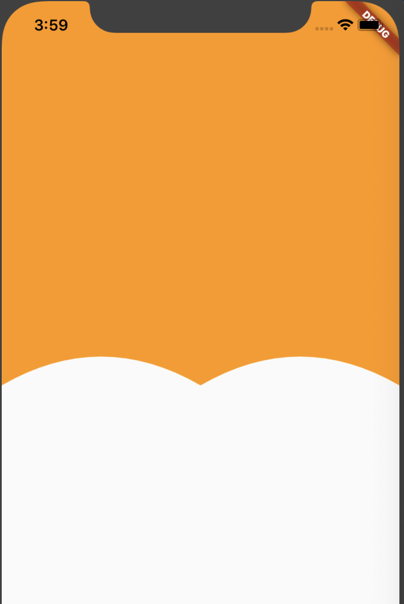
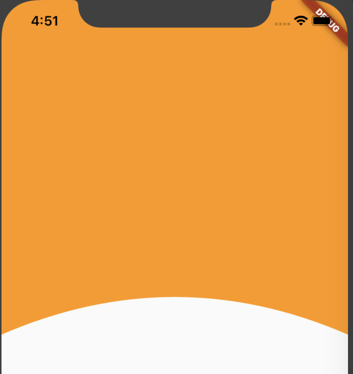
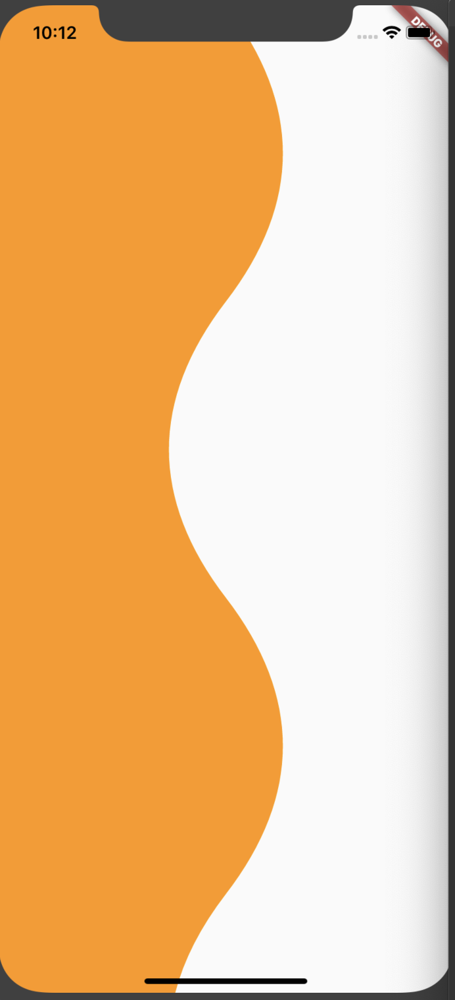
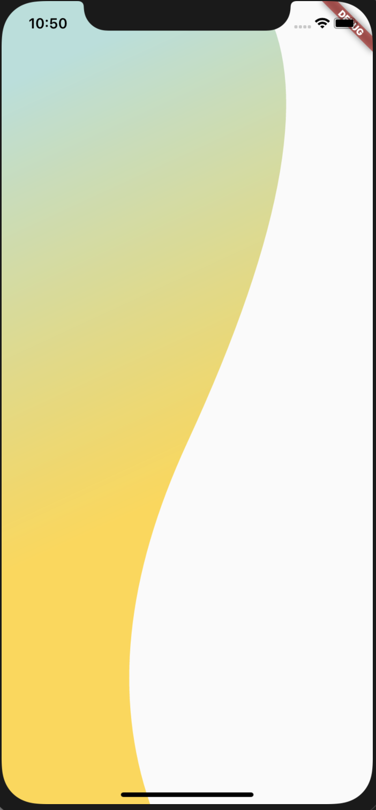

# Clipper code by Dart

1. 

      Path getClip(Size size) {
            final path = Path();
            path.lineTo(0.0, size.height);
            var firstPoint = Offset(size.width*0.25, size.height - 60);
            var firstEndPoint = Offset(size.width*0.5, size.height);
            path.quadraticBezierTo(firstPoint.dx, firstPoint.dy, firstEndPoint.dx, firstEndPoint.dy);
            var sencondPoint = Offset(size.width*0.75, size.height - 60);
            var sencondEndPoint = Offset(size.width, size.height);
            path.quadraticBezierTo(sencondPoint.dx, sencondPoint.dy, sencondEndPoint.dx, sencondEndPoint.dy);
            path.lineTo(size.width, size.height);
            path.lineTo(size.width, 0.0);
            return path;
      }

2.

    Path getClip(Size size) {
        final path = Path();
        path.lineTo(0.0, size.height);
        var firstPoint = Offset(size.width*0.5, size.height - 90);
        var firstEndPoint = Offset(size.width, size.height);
        path.quadraticBezierTo(firstPoint.dx, firstPoint.dy, firstEndPoint.dx, firstEndPoint.dy);
        path.lineTo(size.width, size.height);
        path.lineTo(size.width, 0.0);
        return path;
    }

3.

   Path getClip(Size size) {
        final path = Path();
        path.lineTo(0.0, size.height - 50);
        var firstPoint = Offset(size.width*0.5, size.height + 50);
        var firstEndPoint = Offset(size.width, size.height - 50);
        path.quadraticBezierTo(firstPoint.dx, firstPoint.dy, firstEndPoint.dx, firstEndPoint.dy);
        path.lineTo(size.width, size.height - 50 );
        path.lineTo(size.width, 0.0);
        return path;
  }
       
4.

    Path getClip(Size size) {
        final path = Path();
        path.lineTo(0.0, size.height - 60);
        path.lineTo(size.width*.35, size.height - 60);
        path.lineTo(size.width*.5, size.height);
        path.lineTo(size.width*.65, size.height - 60);
        path.lineTo(size.width, size.height - 60);
        path.lineTo(size.width, 0.0);
        return path;
    }
       
5.

     Path getClip(Size size) {
        final path = Path();
        path.lineTo(size.width*.5,0.0);
        var firstPoint = Offset(size.width*0.75, size.height*.15);
        var firstEndPoint = Offset(size.width*0.5, size.height*.3);
        path.quadraticBezierTo(firstPoint.dx, firstPoint.dy, firstEndPoint.dx, firstEndPoint.dy);
        var sencondPoint = Offset(size.width*0.25, size.height*.45);
        var sencondEndPoint = Offset(size.width*0.5, size.height*.6);
        path.quadraticBezierTo(sencondPoint.dx, sencondPoint.dy, sencondEndPoint.dx, sencondEndPoint.dy);
        var thirdPoint = Offset(size.width*0.75, size.height*.75);
        var thirdEndPoint = Offset(size.width*0.5, size.height*.9);
        path.quadraticBezierTo(thirdPoint.dx, thirdPoint.dy, thirdEndPoint.dx, thirdEndPoint.dy);
        var fourthPoint = Offset(size.width*0.25, size.height*1.05);
        var fourthEndPoint = Offset(size.width*0.5, size.height*1.2);
        path.quadraticBezierTo(fourthPoint.dx, fourthPoint.dy, fourthEndPoint.dx, fourthEndPoint.dy);
        path.lineTo(size.width*.5, size.height);
        path.lineTo(0.0,size.height);
        return path;
  }

6.

    ClipPath(
        clipper: CustomClipper(),
        child: Container(
          decoration: BoxDecoration(gradient:
          LinearGradient(
            begin: Alignment.topCenter,
            colors: [
            Colors.teal[100],
            Colors.amberAccent,
          ],),
          )
        ),
    )
    Path getClip(Size size) {
        final path = Path();
        path.lineTo(size.width*.7,0.0);
        var firstPoint = Offset(size.width*0.9, size.height*.15);
        var firstEndPoint = Offset(size.width*0.5, size.height*.55);
        path.quadraticBezierTo(firstPoint.dx, firstPoint.dy, firstEndPoint.dx, firstEndPoint.dy);
        var sencondPoint = Offset(size.width*0.25, size.height*.8);
        var sencondEndPoint = Offset(size.width*0.4, size.height);
        path.quadraticBezierTo(sencondPoint.dx, sencondPoint.dy, sencondEndPoint.dx, sencondEndPoint.dy);
        path.lineTo(size.width*.5, size.height);
        path.lineTo(0.0,size.height);
        return path;
    }
    